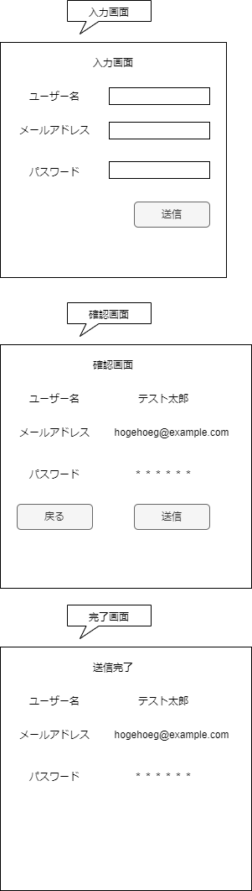

# 08.入力フォーム問題

以下の要件を満たすフォーム機能を実装してください。

* 入力フォーム画面で、ユーザー名、メールアドレス、パスワードを入力することができる。
* 入力された内容を確認する画面で、ユーザー名、メールアドレスを表示する。
* パスワードは伏せ字で表示する。
* 確認画面で、「戻る」ボタンをクリックすると、入力フォーム画面に戻り、入力した内容を修正できる。
* 確認画面で、「送信」ボタンをクリックすると、入力された内容を完了画面に表示する。

## 注意事項
* フォームの各項目は、必須入力とする。
* パスワードは、半角英数字のみで入力することができる。
* メールアドレスの形式チェックを行い、不正な形式の場合はエラーを表示する。
* メールの送信先アドレスは、固定のアドレスとする。
* 入力フォーム、確認画面、送信完了画面は、それぞれ別のページにすること。
* セキュリティに配慮し、入力内容は必ずエスケープすること。 

## 提示

* フォームに入力された値を送信する場合、POSTメソッドを使用すること。
* フォームのバリデーションチェックには、JavaScriptを使用することもできるが、サーバーサイドでもチェックすること。
* フォームの送信結果を表示する場合、HTMLのテーブルを使うと見やすくなる。

## 参考画像

