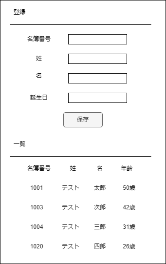

# データベース問題
あなたは、名簿を管理するプログラムを書くことになりました。    
以下の仕様に従って、機能を実装してください。

* プログラムは、以下の操作を行うことができます。
    * 画面上から名簿を登録してデータベースに登録する。
    * 画面上に名簿の一覧を表示する。 一覧で表示する項目は下記になります、　
      * 名簿番号
      * 姓
      * 名
      * 年齢
    * 画面上からひとりずつ名簿データを削除できる。
* 名簿テーブルは、以下のカラムを持ったテーブルに保存されます。
    * 名簿番号：文字列型、プライマリーキー
    * 姓：文字列型
    * 名：文字列型
    * 誕生日：日付型

* phpプログラムのほかに、テーブル構築のsqlファイルを作成してください。

# 参考画像
