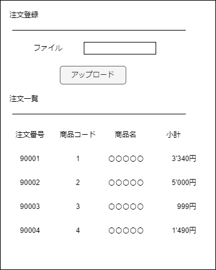

# データベース問題２
あなたは、受注管理システムで注文情報CSVを取り込むをプログラムを書くことになりました。    
以下の仕様に従って、機能を実装してください。


* プログラムは、以下の操作を行うことができます。
  * CSVファイルを画面上から注文情報を取り込む
  * 取り込んだ注文情報をデータベースに登録する
  * 取り込んだ後に、注文一覧を表示する。

* CSVファイルには、以下のカラムが含まれています。
  * 注文番号：文字列型
  * 商品名：文字列型
  * 数量：整数型
  * 単価：整数型
* CSVファイルは、1行目にヘッダがあり、2行目以降に注文情報が含まれています。
* プログラムは、取り込んだ注文情報をデータベースに登録する際に、以下の処理を行います。
  * 商品名が既にマスターに登録されている場合は、該当する商品コードを取得します。
  * 商品名がマスターに登録されていない場合は、新規に商品コードを発番し、マスターに登録します。
  * 注文情報を注文テーブルに登録します。
* 商品マスターは、以下のカラムを持ったテーブルに保存されます。
  * 商品コード：数値型、プライマリーキー
  * 商品名：文字列型
* 注文テーブルは、以下のカラムを持ったテーブルに保存されます。
  * 注文番号：文字列型、プライマリーキー
  * 商品コード：数値型
  * 数量：整数型
  * 単価：整数型

* 注文一覧は、下記の項目を表示してください
  * 注文番号
  * 商品コード
  * 商品名　　　※商品テーブルから取得する事
  * 小計　　　（数量＊単価）
* CSVファイルの文字コードはS-JISで作成してください 
* PHPプログラム、データベースはUTF-8の文字コードを使用してください
* phpプログラムのほかに、テーブル構築のsqlファイルを作成してください。


## 注意点：

* プログラムは、関数やクラスなど、適切な形式で実装してください。
* データベース接続にはPDOを用いてください。
* クエリの実行には、プリペアドステートメントを用いてください。


# 参考画像



## 入力例1（CSVファイル）：

```
注文番号,商品名,数量,単価
ORDER001,商品A,3,1000
ORDER002,商品B,2,2000
ORDER003,商品A,1,1000
```

## 出力例2：

データを登録しました。

注文番号	商品コード	商品名	小計
ORDER001	1	商品A	3000
ORDER002	2	商品B	4000
ORDER003	1	商品A	1000


## 入力例2（CSVファイル）：
```
注文番号,商品名,数量,単価
ORDER101,商品A,3,1000
ORDER102,商品B,2,2000
ORDER103,商品C,1,1000
```

## 出力例2：
データを登録しました。

注文番号	商品コード	商品名	小計
ORDER101	1	商品A	3000
ORDER102	2	商品B	4000
ORDER103	3	商品C	1000


